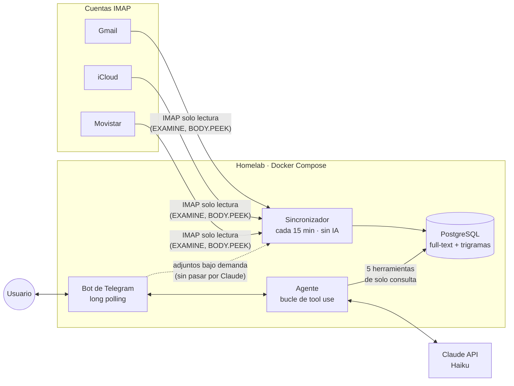

# Mail Agent

Agente personal de correo para un homelab: indexa varias cuentas IMAP en
PostgreSQL y responde preguntas en lenguaje natural por Telegram, usando
Claude con herramientas que **solo consultan la base de datos**. Nunca envía,
mueve, marca ni borra correos.

> 🚧 **En desarrollo.** Diseño, esquema de base de datos y definición de
> herramientas terminados (fase 1). Ver [estado del proyecto](#estado-del-proyecto).

## Qué hace

Ejemplos de preguntas que responde:

- *"¿Me ha respondido alguien al correo que envié el lunes sobre la oferta de ACME?"*
- *"Búscame la factura de la luz de agosto"* → responde y ofrece el PDF para descargar
- *"¿Qué correos importantes he recibido hoy?"* / *"Resúmeme el día"*
- *"¿Quién no me ha contestado esta semana?"*

Responde en el idioma en que le escribas (castellano, catalán o inglés).

## Arquitectura



Tres piezas en un único servicio Spring Boot:

1. **Sincronizador** — lee INBOX y Enviados de cada cuenta en solo lectura y
   los guarda en Postgres de forma incremental (UID/UIDVALIDITY) e
   idempotente. Limpia el HTML, recorta citas y firmas, extrae el texto de los
   PDF adjuntos y reconcilia los borrados una vez al día.
2. **Agente** — bucle de tool use implementado a mano con el SDK oficial de
   Anthropic para Java, con límite de iteraciones, presupuesto diario y
   registro de tokens y coste por petición.
3. **Bot de Telegram** — interfaz con lista blanca de chat ID, historial de
   conversación persistido y botones para ver correos y descargar adjuntos.

### Herramientas del agente

| Herramienta | Para qué sirve |
|---|---|
| `search_emails` | Búsqueda combinando remitente, destinatario, asunto, texto completo, fechas, dirección, no leídos y adjuntos |
| `get_email` | Correo completo (sin citas ni firma) y lista de adjuntos |
| `get_thread` | Hilo reconstruido con `Message-ID` / `In-Reply-To` / `References`, también entre cuentas distintas |
| `find_unanswered` | Correos enviados que nadie ha respondido todavía |
| `get_day_digest` | Material para resumir un día: totales, importantes y resto agrupado por remitente |

Las definiciones (JSON Schema) están en
[`src/main/resources/agent/tools`](src/main/resources/agent/tools).

## Seguridad

El contenido de un correo lo escribe cualquiera, así que el diseño parte de que
**puede contener prompt injection** y limita lo que un atacante podría
conseguir:

- **Solo lectura de extremo a extremo.** Las carpetas IMAP se abren con
  `READ_ONLY` y los cuerpos se leen con `BODY.PEEK`. El agente no tiene
  ninguna herramienta que escriba: consulta Postgres, nunca IMAP en directo.
- **Remitentes protegidos.** Los correos de dominios excluidos (bancos,
  salud…) se indexan pero su contenido **nunca se envía a Claude**: el modelo
  solo ve un ID y una fecha, y el usuario los abre con un botón que lee
  directamente de la base de datos.
- **Sin canal de exfiltración.** Las respuestas se envían en texto plano y sin
  vistas previas de enlaces, para que una URL generada por una injection no
  pueda filtrar datos a terceros.
- **Referencias validadas.** El modelo solo puede ofrecer correos o adjuntos
  que una herramienta le haya devuelto en esa misma petición.
- **Sin exposición a internet.** El bot usa long polling (no abre puertos) y
  solo atiende chat IDs autorizados; el resto del acceso es por WireGuard.
- **Límites de coste.** Máximo de iteraciones por pregunta y presupuesto
  diario en dólares; cada ejecución queda auditada con sus llamadas a
  herramientas.

## Stack

| | |
|---|---|
| Lenguaje y framework | Java 25 · Spring Boot 4.1 |
| Persistencia | PostgreSQL 17 (`unaccent`, `pg_trgm`, tsvector) · Flyway · `JdbcClient` |
| Correo | Eclipse Angus Mail (Jakarta Mail) · Jsoup · Apache PDFBox |
| IA | SDK oficial de Anthropic para Java · Claude Haiku 4.5 (configurable) |
| Interfaz | TelegramBots (long polling) |
| Tests | JUnit 5 · Mockito · AssertJ · Testcontainers · GreenMail · ArchUnit |
| Despliegue | Docker · Docker Compose |

## Diseño

Arquitectura hexagonal ligera, un único módulo Maven con cuatro contextos:

```
dev.perecollet.mailagent
├── mail/       consultas sobre el correo indexado (lo que usan las herramientas)
├── sync/       ingesta IMAP → Postgres
├── agent/      bucle de tool use, conversaciones y coste
└── telegram/   interfaz de usuario
```

Cada contexto separa `domain` (sin frameworks), `application` (casos de uso y
puertos) y `adapter`. Las reglas de dependencia se verifican con ArchUnit.

Las decisiones de diseño, el esquema de base de datos y el funcionamiento de
cada pieza están explicados en [`docs/design.md`](docs/design.md).

## Estado del proyecto

- [x] **Fase 1 · Diseño** — arquitectura, esquema y migraciones Flyway, definición de herramientas
- [ ] **Fase 2 · Sincronizador IMAP** y tests
- [ ] **Fase 3 · Agente** (bucle de tool use y herramientas) y tests
- [ ] **Fase 4 · Bot de Telegram**
- [ ] **Fase 5 · Despliegue** — Dockerfile, servicio de Compose y guía de instalación

## Puesta en marcha

Disponible al terminar la fase 5. La configuración irá en un fichero `.env`
(cuentas IMAP con contraseñas de aplicación, API key de Anthropic, token del
bot y lista de chat IDs autorizados) a partir de un `.env.example` documentado.

## Licencia

[MIT](LICENSE)
