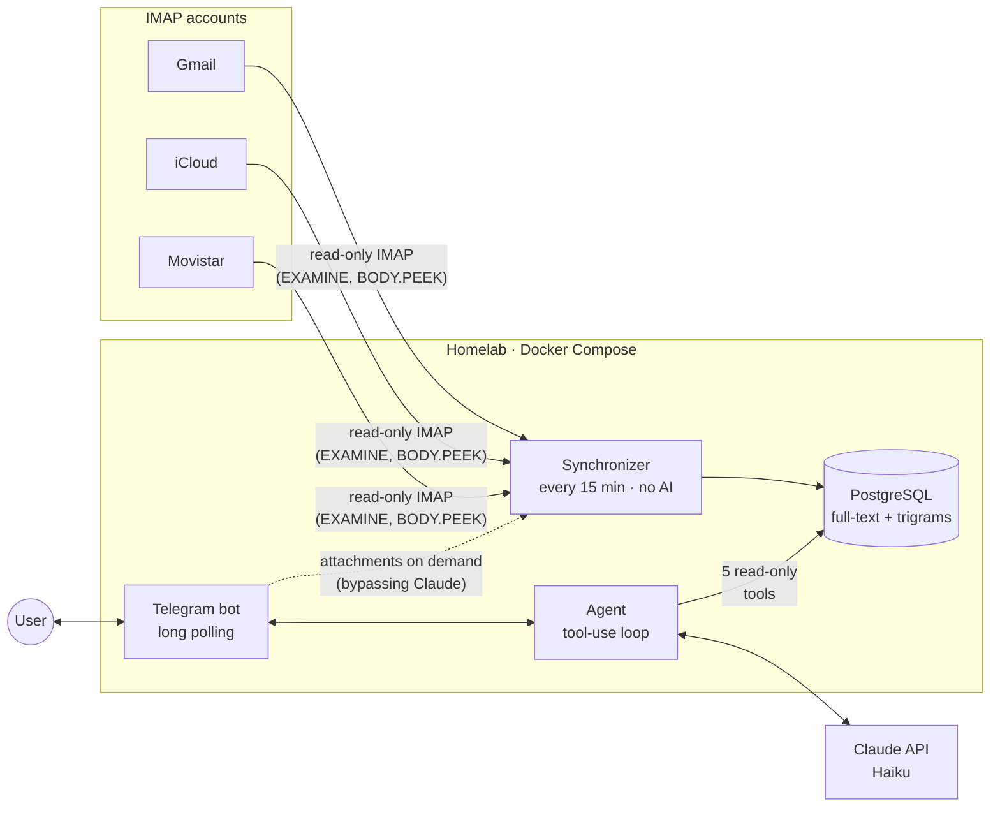

# Mail Agent

A personal email agent for a homelab: it indexes several IMAP accounts into
PostgreSQL and answers natural-language questions over Telegram, using Claude
with tools that **only query the database**. It never sends, moves, flags or
deletes email.

> 🚧 **Work in progress.** Design, database schema and tool definitions are
> done (phase 1). See [project status](#project-status).

## What it does

Example questions it answers:

- *"Did anyone reply to the email I sent on Monday about the ACME job offer?"*
- *"Find my electricity bill from August"* → answers and offers the PDF for download
- *"What important emails did I get today?"* / *"Summarize my day"*
- *"Who hasn't replied to me this week?"*

It replies in whatever language you write in (Spanish, Catalan or English).

## Architecture



Three components in a single Spring Boot service:

1. **Synchronizer** — reads the INBOX and Sent folders of each account in
   read-only mode and stores them in Postgres incrementally (UID/UIDVALIDITY)
   and idempotently. It cleans up HTML, strips quoted replies and signatures,
   extracts text from PDF attachments and reconciles deletions once a day.
2. **Agent** — a hand-written tool-use loop on top of Anthropic's official
   Java SDK, with an iteration cap, a daily budget, and token and cost
   tracking per request.
3. **Telegram bot** — the user interface, with a chat ID allowlist, persisted
   conversation history, and buttons to view emails and download attachments.

### Agent tools

| Tool | Purpose |
|---|---|
| `search_emails` | Search by sender, recipient, subject, full text, dates, direction, unread status and attachments |
| `get_email` | Full email (without quotes or signature) plus its attachment list |
| `get_thread` | Thread rebuilt from `Message-ID` / `In-Reply-To` / `References`, even across accounts |
| `find_unanswered` | Sent emails that nobody has replied to yet |
| `get_day_digest` | Material to summarize a day: totals, important emails, and the rest grouped by sender |

The definitions (JSON Schema) live in
[`src/main/resources/agent/tools`](src/main/resources/agent/tools).

## Security

Anyone can write an email, so the design assumes that **any email may contain
a prompt injection** and limits what an attacker could achieve:

- **Read-only end to end.** IMAP folders are opened `READ_ONLY` and bodies are
  fetched with `BODY.PEEK`. The agent has no tool that writes anything: it
  queries Postgres, never IMAP directly.
- **Protected senders.** Emails from excluded domains (banks, healthcare…) are
  indexed, but their content is **never sent to Claude**: the model only sees
  an ID and a date, and the user opens them with a button that reads straight
  from the database.
- **No exfiltration channel.** Replies are sent as plain text with link
  previews disabled, so a URL produced by an injection cannot leak data to a
  third party.
- **Validated references.** The model can only offer emails or attachments
  that a tool returned within that same request.
- **Not exposed to the internet.** The bot uses long polling (no open ports)
  and only answers allowlisted chat IDs; any other access goes through
  WireGuard.
- **Cost limits.** A maximum number of iterations per question and a daily
  budget in dollars; every run is audited along with its tool calls.

## Tech stack

| | |
|---|---|
| Language & framework | Java 25 · Spring Boot 4.1 |
| Persistence | PostgreSQL 17 (`unaccent`, `pg_trgm`, tsvector) · Flyway · `JdbcClient` |
| Email | Eclipse Angus Mail (Jakarta Mail) · Jsoup · Apache PDFBox |
| AI | Anthropic Java SDK · Claude Haiku 4.5 (configurable) |
| Interface | TelegramBots (long polling) |
| Testing | JUnit 5 · Mockito · AssertJ · Testcontainers · GreenMail · ArchUnit |
| Deployment | Docker · Docker Compose |

## Design

Lightweight hexagonal architecture in a single Maven module with four bounded
contexts:

```
dev.perecollet.mailagent
├── mail/       queries over the indexed mailbox (what the tools use)
├── sync/       IMAP → Postgres ingestion
├── agent/      tool-use loop, conversations and cost tracking
└── telegram/   user interface
```

Each context separates `domain` (framework-free), `application` (use cases and
ports) and `adapter`. Dependency rules are enforced with ArchUnit.

Design decisions, the database schema and how each component works are
explained in [`docs/design.md`](docs/design.md).

## License

[MIT](LICENSE)
